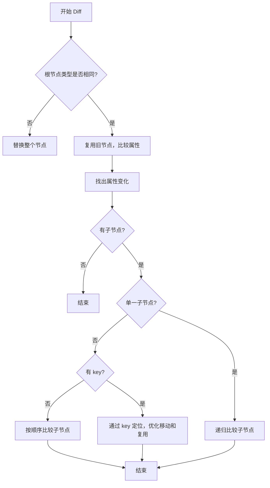
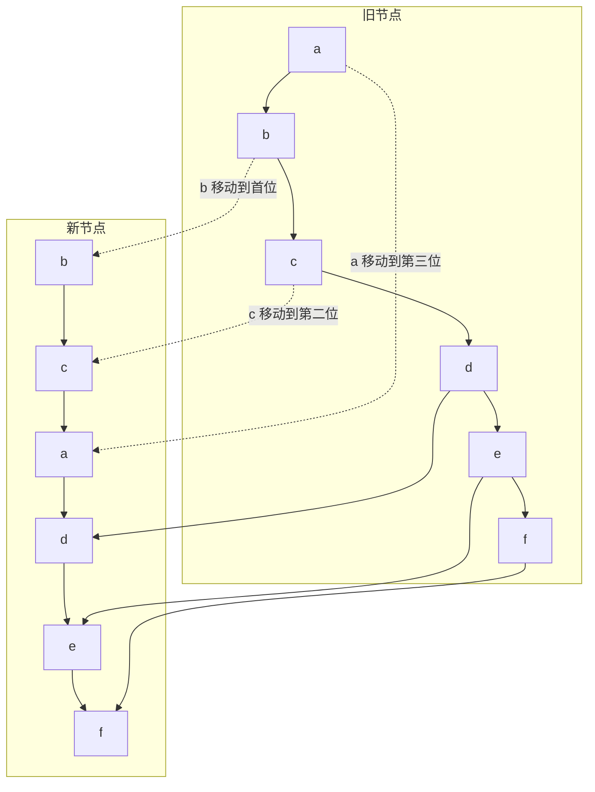

# React Diff 算法简述

React 的 diff 算法用于高效比较前后两棵虚拟 DOM 树，找出最小的 DOM 更新。

## 核心思想
- 只对同一层级的节点进行比较，不跨层级
- 通过 key 标识，优化列表节点的复用和移动
- 递归比较子节点，逐步找出差异

## 主要流程
1. 比较根节点类型：
   - 类型不同，直接替换整个节点
   - 类型相同，复用旧节点，递归比较属性和子节点
2. 比较属性：
   - 找出新增、删除、修改的属性
3. 比较子节点：
   - 单一子节点递归比较
   - 多个子节点时，先按顺序比较，再用 key 优化移动和复用

## 列表 diff
- 没有 key：按顺序比较，性能较低
- 有 key：通过 key 快速定位节点，提升性能，减少不必要的移动

## 总结
React diff 算法通过分层、key 优化等策略，实现了高效的虚拟 DOM 更新，保证页面性能。

## 流程图

## 示例：旧节点 abcdef，新节点 bcadef

### 步骤说明
1. 旧节点：a b c d e f
2. 新节点：b c a d e f
3. React 通过 key 发现 b、c、a 只是顺序变化，d e f 保持不变
4. 复用 b、c、a 节点，并调整顺序，d e f 直接复用

### Mermaid 步骤图

### 总结
- b、c、a 复用并调整顺序
- d、e、f 直接复用
- 有 key 时，React 只做最小必要的移动和复用，性能最优