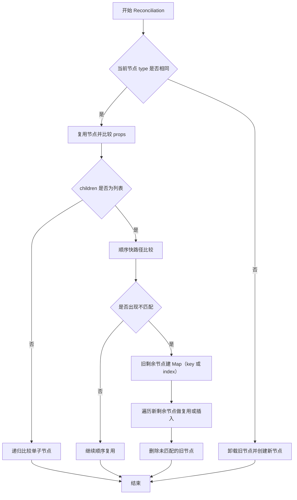
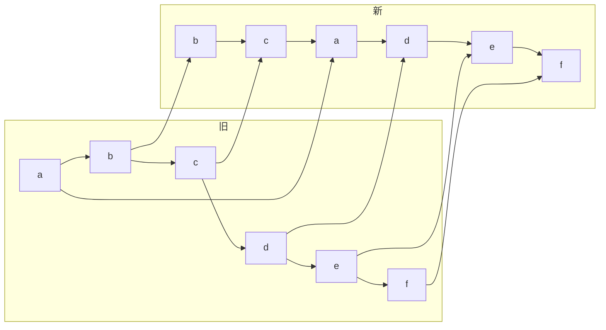

# React Diff（Reconciliation）详解

React 的 diff 本质是 **Reconciliation（协调）**：比较“旧 Fiber 树”和“新元素树”，决定哪些节点复用、更新、插入、删除。
它不是通用最短编辑距离算法，而是基于前端场景做的启发式策略，目标是：**在可接受复杂度下足够快**。

## 为什么 React 不做“最优 diff”

- 通用树编辑距离的理论复杂度高，真实 UI 场景中成本太大。
- React 采用近似策略，把复杂问题拆成可线性处理的子问题，常见场景能接近 O(n)。
- 换句话说：React 更追求“稳定快”，而不是“数学上的全局最优移动次数”。

## 核心假设（非常关键）

1. **不同类型的节点，通常对应不同子树**
- 例如 `div -> span`、`Article -> Comment`，React 直接认为“整体替换更合理”。

2. **开发者用 `key` 告诉 React 哪些列表项是同一个节点**
- 有稳定 `key`，React 才能跨位置识别“这是同一项”并复用状态。
- 没有 `key` 或 `key` 不稳定（如随机数），复用会变差，甚至引发状态错位。

## Diff 总流程

1. 比较根节点（或当前层节点）类型
- 类型不同：卸载旧节点，创建新节点（旧子树不会继续深度复用）。
- 类型相同：复用节点实例，继续比较 props 和 children。

2. 比较 props
- 只更新变化的属性（className、style、事件等）。
- 没变的属性不会重复写入 DOM。

3. 比较 children（重点）
- 单子节点：递归比较。
- 多子节点（数组）：进入列表 diff 策略（是否有 `key` 决定效果）。

## 列表 Diff：React 实际在做什么

以 `reconcileChildrenArray` 的思路可简化为两段：

1. **从左到右先“顺序对比”**
- 如果同位置节点可复用（同 type 且 key 匹配），直接复用并前进。
- 一旦遇到不匹配，停止这段顺序快路径。

2. **为剩余旧节点建索引，再匹配剩余新节点**
- 旧节点按 `key`（无 key 时退化为 index）放入 Map。
- 遍历新节点，按 key 查找可复用旧节点：
  - 找到：复用并标记是否需要移动。
  - 找不到：创建新节点（插入）。
- 最后 Map 里剩下的旧节点全部删除。

> 这就是“先快路径、再哈希匹配”的核心思想。

## React 如何判断“移动”

- React 维护一个 `lastPlacedIndex`（已确认无需移动的最大旧索引）。
- 若某可复用旧节点的旧索引 `< lastPlacedIndex`，说明它相对顺序后退了，需要移动。
- 否则可原地复用，更新 `lastPlacedIndex`。

这套规则让 React 用线性遍历完成大部分判断，但它 **不保证全局最少移动次数**（这是有意的性能取舍）。

## key 的正确使用

- `key` 在“同一层兄弟节点内唯一”即可，不需要全局唯一。
- 推荐使用稳定业务 id（如数据库主键）。
- 不建议用随机值或会变化的值。
- 列表会增删/重排时，不建议用 index 作为 key（容易状态错位）。

## 常见误区

- “加了 key 就不会重渲染”  
  错。`key` 主要用于识别和复用节点，不等于跳过 render。

- “key 只为性能，不影响正确性”  
  错。错误 key 可能导致输入框值、勾选状态等和数据错位。

- “React diff 一定是最小 DOM 操作”  
  错。React 追求的是高性能近似最优，而非全局最优解。

## 一个例子：旧节点 abcdef，新节点 bcadef

前提：每项都有稳定 key（a~f）。

1. 旧：a b c d e f  
2. 新：b c a d e f  
3. `b`、`c`、`a` 都能通过 key 复用，但顺序发生变化。  
4. `d e f` 位置连续且顺序不变，直接复用。  
5. 最终效果：少量移动 + 大量复用，而不是整段重建。

## 流程图（简化）

```mermaid
flowchart TD
    A["开始 Reconciliation"] --> B{"当前节点 type 是否相同"}
    B -->|否| C["卸载旧节点并创建新节点"]
    B -->|是| D["复用节点并比较 props"]
    D --> E{"children 是否为列表"}
    E -->|否| F["递归比较单子节点"]
    E -->|是| G["顺序快路径比较"]
    G --> H{"是否出现不匹配"}
    H -->|否| I["继续顺序复用"]
    H -->|是| J["旧剩余节点建 Map（key 或 index）"]
    J --> K["遍历新剩余节点做复用或插入"]
    K --> L["删除未匹配的旧节点"]
    F --> M[结束]
    I --> M
    L --> M
    C --> M
```

## 示例图：abcdef -> bcadef

```mermaid
graph LR
    subgraph 旧
      A1[a] --> B1[b] --> C1[c] --> D1[d] --> E1[e] --> F1[f]
    end
    subgraph 新
      A2[b] --> B2[c] --> C2[a] --> D2[d] --> E2[e] --> F2[f]
    end

    B1 --> A2
    C1 --> B2
    A1 --> C2
    D1 --> D2
    E1 --> E2
    F1 --> F2
```

## 总结

- React diff 是启发式 Reconciliation，不做昂贵的全局最优树编辑距离。
- “同层比较 + type 判断 + key 识别”是性能与正确性的核心。
- 列表场景下，稳定 key 能显著提升复用率并避免状态错位。
- 理解 `lastPlacedIndex` 思路后，就能解释多数“为什么这个节点被移动/重建”的问题。