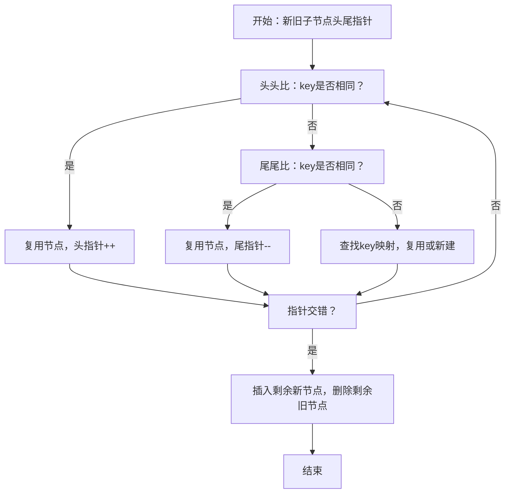

# vue2 diff算法简明说明

## 1. 目的
高效对比新旧虚拟DOM树，找出最小的DOM操作，提升渲染性能。

## 2. 核心思想
- 只对同层节点进行比较（不跨层）。
- 通过 key 快速定位可复用节点，减少不必要的移动和删除。
- 采用双端比较法（头尾指针），高效处理常见的头部、尾部插入/删除场景。

## 3. 主要流程
1. 新旧节点头尾各设指针（oldStart, oldEnd, newStart, newEnd）。
2. 循环比较：
   - 头头比、尾尾比、头尾比、尾头比，若命中则直接复用并移动指针。
   - 若都不命中，用 key 建立映射，查找新节点在旧节点中的位置，若找到则复用并移动，否则新建。
3. 指针交错后，剩余新节点插入，剩余旧节点删除。

## 4. 简化伪代码
```js
function diff(oldChildren, newChildren) {
  let oldStart = 0, oldEnd = oldChildren.length - 1;
  let newStart = 0, newEnd = newChildren.length - 1;
  while (oldStart <= oldEnd && newStart <= newEnd) {
    if (oldChildren[oldStart].key === newChildren[newStart].key) {
      // 头头比，复用
      patch(oldChildren[oldStart], newChildren[newStart]);
      oldStart++; newStart++;
    } else if (oldChildren[oldEnd].key === newChildren[newEnd].key) {
      // 尾尾比，复用
      patch(oldChildren[oldEnd], newChildren[newEnd]);
      oldEnd--; newEnd--;
    } else {
      // 其他情况，查找key复用或新建
      // ...省略
      newStart++;
    }
  }
  // 处理剩余新节点插入、旧节点删除
}
```

## 5. 流程图


## 6. 重点与局限
- 只比较同层节点，不能跨层复用。
- key 的合理使用能极大提升 diff 性能。
- vue2 diff 算法是“简单高效”的工程折中，非最优解，但适合大多数场景。