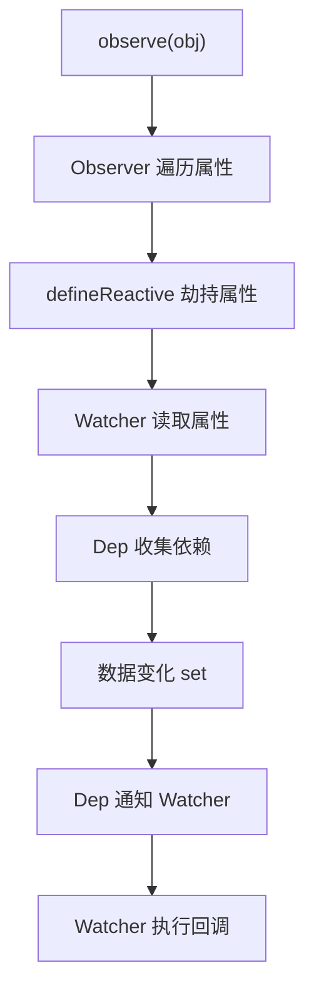

# vue2响应式实现原理说明

## 1. defineReactive

定义对象的响应式属性，拦截属性的读取和设置。

- 通过 `Object.defineProperty`劫持属性的get/set。
- get时收集依赖，set时通知依赖更新。

## 2. Observer

遍历对象的每个属性，将其转为响应式。

- 对每个key调用 `defineReactive`。
- 只处理对象的第一层属性。

## 3. observe

响应式系统的入口函数。

- 判断参数是否为对象。
- 是对象则调用 `Observer`。

## 4. Dep

依赖收集器，管理依赖（订阅者）。

- `depend`方法收集依赖。
- `notify`方法通知所有依赖更新。
- 依赖通过 `Dep.target`临时存储。

## 5. Watcher

订阅者，响应数据变化。

- 创建时会把自身注册到依赖中。
- 数据变化时，自动调用 `update`方法执行回调。

## 6. 工作流程

1. 调用 `observe(obj)`，将对象变为响应式。
2. 创建 `Watcher`，读取属性，收集依赖。
3. 属性变化时，触发 `set`，通知所有Watcher执行回调。

## 7. 设计特点

- 函数式实现，无类。
- 只处理对象的第一层属性。
- 依赖收集和通知通过Dep实现。

## 8. 数组响应式原理

- vue2无法直接通过Object.defineProperty监听数组索引和length变化。
- 通过重写数组原型的7个变更方法（push、pop、shift、unshift、splice、sort、reverse），在方法内部手动通知依赖更新。
- observe时如果是数组，会将其原型指向自定义的arrayMethods，并递归observe每一项。
- 每次调用这些方法，都会触发依赖收集器dep.notify()，实现响应式。
- 局限：无法监听通过索引直接赋值（如arr[1]=xxx）和length变化。
