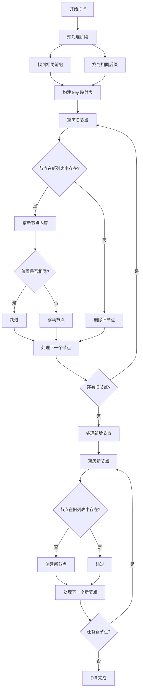

# Vue3 Diff 算法步骤

## 1. 快速 Diff 算法
Vue3 采用快速 Diff 算法，相比 Vue2 的双端 Diff，性能更优。

## 2. 核心步骤

### 第一步：预处理
- 从头部开始，找到相同的前缀节点
- 从尾部开始，找到相同的后缀节点
- 如果前缀和后缀完全覆盖，说明只是中间部分需要处理

### 第二步：构建 key 映射
- 为新的子节点建立 key 到索引的映射表
- 用于快速定位节点位置

### 第三步：更新和移动
- 遍历旧的子节点
- 根据 key 在新节点中查找
- 如果找到，更新节点内容
- 如果位置不同，移动节点到正确位置
- 如果没找到，删除旧节点

### 第四步：新增节点
- 遍历新的子节点
- 如果旧节点中没有对应 key，创建新节点

## 3. 优势
- 时间复杂度：O(n)，比 Vue2 的 O(n²) 更高效
- 减少不必要的 DOM 操作
- 更好的节点复用策略

## 4. 示例
旧节点：A B C D E
新节点：A B F C E

处理过程：
1. 前缀 A B 相同，跳过
2. 后缀 E 相同，跳过  
3. 中间部分：C D → F C
4. 移动 C 到 F 后面，删除 D，新增 F

## 5. 步骤流程图



## 6. 详细执行示例

```mermaid
graph LR
    subgraph "旧节点列表"
        A1[A] B1[B] C1[C] D1[D] E1[E]
    end
    
    subgraph "新节点列表" 
        A2[A] B2[B] F2[F] C2[C] E2[E]
    end
    
    A1 -.->|前缀相同| A2
    B1 -.->|前缀相同| B2
    E1 -.->|后缀相同| E2
    
    C1 --> C2
    D1 --> X[删除]
    F2 --> Y[新增]
```

## 7. 性能对比

| 算法 | 时间复杂度 | 空间复杂度 | 适用场景 |
|------|------------|------------|----------|
| Vue2 双端 Diff | O(n²) | O(n) | 简单列表 |
| Vue3 快速 Diff | O(n) | O(n) | 复杂列表 |

## 8. React Diff 对比

### 相同点
- 都采用虚拟 DOM，进行同层级节点比较，不跨层级
- 都通过 key 优化列表节点的复用和移动
- 都追求最小化 DOM 操作，提高性能

### 不同点
- **React**：
  - 采用递归分层 diff，遇到不同类型节点直接替换
  - 列表 diff 时，先顺序比较，再用 key 定位，移动和复用节点
  - 没有最长递增子序列（LIS）优化，移动节点时可能不是最优
  - 主要关注 UI 层，diff 逻辑相对简单
- **Vue3**：
  - 采用快速 diff + LIS 算法，能找到最优移动方案，减少 DOM 操作
  - 预处理前后缀相同节点，进一步减少比较范围
  - 构建 key 映射表，查找和复用节点更高效
  - diff 逻辑更复杂，性能更优

### 总结
- React diff 算法简单高效，适合大多数场景
- Vue3 diff 算法在极端复杂列表场景下性能更优，移动节点更智能
- 实际开发中，两者都能满足绝大多数性能需求


